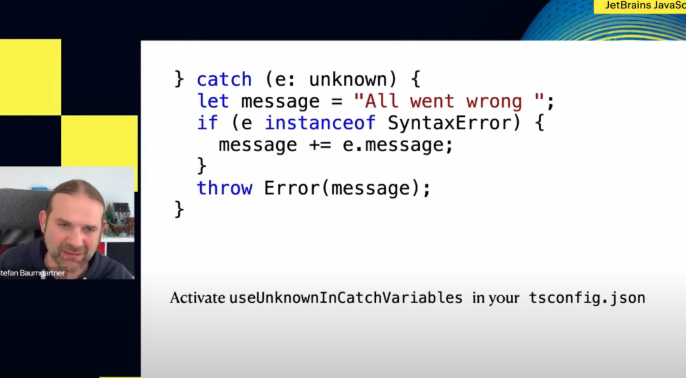

# TS Snippets

## Show result in Playground // ^?

`//   ^?` this shows the result of the upper line inside TS Playground

## Generics in arrow functions

```ts
// Test function, T generated by expectedType
type TUseSearchParam = <T>(paramName: string, expectedType: "string" | "array" | "showOnlyMyIssues") => T;

const useSearchParam: TUseSearchParam = <T extends unknown>( // extends unknown required
  paramName: string,
  expectedType: "string" | "array" | "showOnlyMyIssues"
) => {
  const arrayReturn: string[] = ["test"];
  const stringReturn: string = "test";
  const booleanReturn = true;

  switch (expectedType) {
    case "array":
      return arrayReturn as T;
    case "showOnlyMyIssues":
      return booleanReturn as T;
    case "string":
      return stringReturn as T;
  }
};

// Same function rewritten not as Arrow Function
function useSearchParam<T>(paramName: string, expectedType: "string" | "array" | "showOnlyMyIssues") {
  const arrayReturn: string[] = ["test"];
  const stringReturn: string = "test";
  const booleanReturn = true;

  switch (expectedType) {
    case "array":
      return arrayReturn as T;
    case "showOnlyMyIssues":
      return booleanReturn as T;
    case "string":
      return stringReturn as T;
  }
}

// Type computed from function
type TUseSearchParam = typeof useSearchParam;
```

## Loop a Union Type

```typescript
type ConvertPropertiesToString<T extends string> = {
  [K in T]: string;
};

type NS = ConvertPropertiesToString<"a" | "b">; // ("a" | "b") is a subset (sottotipo) of string
```

## Import only types

From https://www.typescriptlang.org/docs/handbook/modules.html#importing-types

```ts
// Explicitly use import type
import type { APIResponseType } from "./api";
// Explicitly pull out a value (getResponse) and a type (APIResponseType)
import { getResponse, type APIResponseType } from "./api";
```

## Get keys of a Type

```typescript
// K in keyof T
type ConvertPropertiesToString<T> = {
  [K in keyof T]: string;
};

type MyOmit<T, U> = {
  [K in keyof T as K extends U ? never : K]: T[K]; // For every key in T do a conditional (in this case if K === U)
};
```

## Set type's properties as readonly quickly

```typescript
const readOnlyTest = {
  a: "valueA",
  b: "valueB",
} as const;
//   ^?
// type const = { readonly a: "valueA", readonly b: "valueB" }

readOnlyTest.a = "newValueA"; // Error: a property is readonly

type readOnlyTestKeys = keyof typeof readOnlyTest;
```

## Remove a property

Using `-` a property can be removed:

```typescript
type CustomRequired<T> = {
  [K in keyof T]-?: T[K]; // by using - the optional property will be removed
};
```

```typescript
interface Props {
  readonly a: string;
  readonly b: string;
}

type CustomEditable<T> = {
  -readonly [K in keyof T]: T[K]; // by using - the readonly property will be removed
};

type EditableProps = CustomEditable<Props>;

const c: EditableProps = {
  a: "a",
  b: "b",
};

c.a = "aa";
c.b = "bb";
```

## Conditionals

A conditional can be made though `extends ? [RESULT-IF-TRUE] : [RESULT-IF-FALSE]`

```typescript
// Simple checking if T is a string
export type IsAString<T> = T extends string ? "string" : "not-a-string";

type S = string;
type N = number;
type SN = string | number | "other";

type ResultString = IsAString<S>; // type ResultString = "string"
type ResultNumber = IsAString<N>; // type ResultNumber = "not-a-string"

// This will be both, condition is applied for all elements in union type and then merged
type ResultStringNumber = IsAString<SN>; // type ResultStringNumber = "string" | "not-a-string"
```

## Generate dynamic keys

```typescript
type TStringFilter<T extends string | number> = { [K in "equals" | ("notEquals" & string) as `${T}.${K}`]?: string };

const language: TStringFilter<"language"> = {
  "language.equals": "1",
  "language.notEquals": "3",
};
```

## A way to access not exported properties

This is also useful while debugging

```typescript
type SelectItem = { id: string; label: string };

type SingleSelectProps = {
  options: SelectItem[];
  onChange: (item: SelectItem) => void;
};

type MultipleSelectProps = {
  options: SelectItem[];
  multiple: boolean;
  onChange: (items: SelectItem[]) => void;
};

type SelectProps = SingleSelectProps | MultipleSelectProps;

// Useful way to debug union types
// this results => type onChange = ((item: SelectItem) => void) | ((items: SelectItem[]) => void)
type onChange = SelectProps["onChange"];
```

## infer

Used for caching a type from another type.

It must be used inside a conditional, before the tyoe you want to catch.

```typescript
// Here infer is used for catching the function returned value.
export type CustomReturnType<T> = T extends () => infer P ? P : void;

// Testing
// type T0 = string
type T0 = CustomReturnType<() => string>;

// type T1 = void
type T1 = CustomReturnType<(s: string) => void>;

// type T2 = unknown
type T2 = CustomReturnType<<T>() => T>;
```

## Optionally call a function if exists

```typescript
open?.({
  message: t("error"),
  type: "error",
});
```

## Handling types union errors

```ts
type Mail = {
  message: string;
};

type Phone = {
  text: string;
};

// trying to access the message property
const info = (obj: Mail | Phone): string => {
  // Property 'message' does not exist on type 'Mail | Phone'.
  if (obj.message) {
    return obj.message;
  }

  // Correct
  if ("message" in obj) {
    return obj.message;
  }

  return obj.text;
};
```

## Better error handling

Javascript can throw any error. So catch Error can't be typed.

From: https://www.youtube.com/live/9VzdTwPC-Rs?si=peg4_vMylpCbiUcl&t=7686

```ts
try {
  // Code
} catch (e: unknown) {
  let message = "Error ";

  if (e instanceOf SyntaxError) {
    message += e.message;
  }

  throw Error(message);
}

// Activate useUnknownInCatchVariables in tsconfig.json
```


