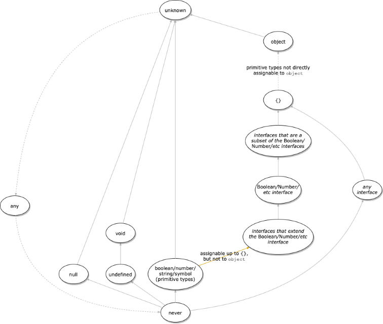

# Typescript

## TS Primitives structure

- Think `extends` as "subtype of"
- `unknown` could be everything
- `never` could be nothing, also means never reach
- `number` extends `{}` (think about number prototype)
- `object` differs from `{}`
    - `{}` which is the same as type `Object` is the least specific. You can assign objects, arrays and primitives to it.
    - `object` is more specific and is similar to `{ [key: string]: any }`. You can assign objects and arrays to it, but not primitives.
    - `{ [key: string]: string }` is the most specific, that doesn't allow any primitive types, arrays or objects with a non-string value to be assigned to it.

Some examples [here](./sections/ts-primitives.md)

### Tips

- use `strict` mode
- using "as" assertion is the first step to bring unsafe code
- function declaration with types is more readble then const declaration with types
- Use Union Types instead of Enum when the values doesn't change a lot
- [use more types than interfaces because of better componibility](./sections/more-types.md)

## TS Snippets
[ts snippets](./sections/ts-snippets.md) for advanced types.

## TS Exercises

Rewrite Typescript's utility types:
https://www.typescriptlang.org/docs/handbook/utility-types.html

This exercise cover almost all real use cases in TS.

Solutions in `/ts-exercise-solutions`